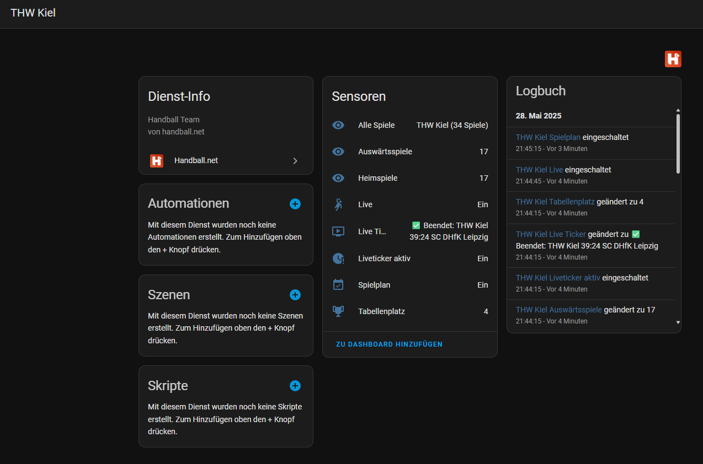
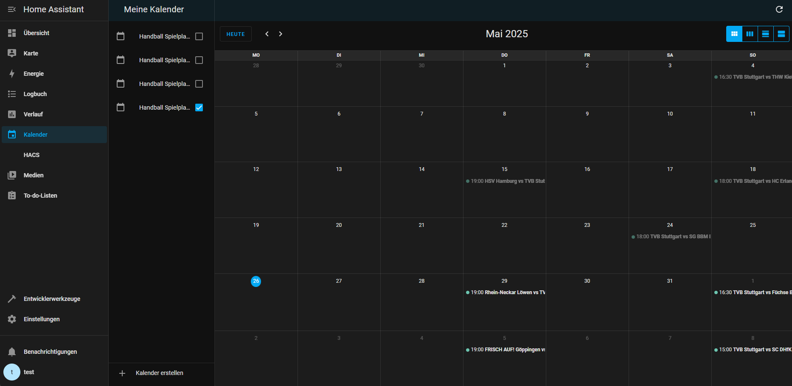

# hass-handball.net

> [Handball.net](https://handball.net) Home Assistant Custom Component

## Installation

### HACS (recommended)

1. Open HACS
2. add this repository as a custom repository
3. search for "Handball.net" in the HACS store
4. install the integration
5. restart Home Assistant

### Manual

Copy the `custom_components/handball_net` folder to your Home Assistant `custom_components` folder. Then restart Home Assistant.

## Configuration

1. Open the Home Assistant UI
2. Go to `Configuration` > `Integrations`
3. Click on `+ Add Integration`
4. Search for `Handball.net`
5. Enter the team ID of your team (e.g. `12345` for `https://handball.net/team/12345`)
6. Click on `Submit`

## Example

## Features

- Fetches team information from [Handball.net](https://handball.net)
- Creates sensors for home and away games
- Creates calendar events for games
- Supports multiple teams
